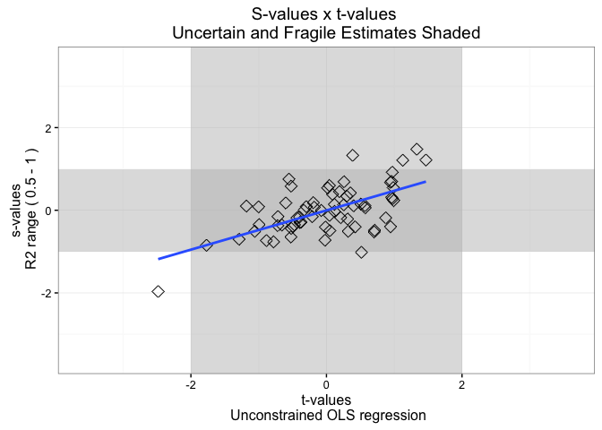

<!-- README.md is generated from README.Rmd. Please edit that file -->
[](https://travis-ci.org/carloscinelli/sValues) [](https://codecov.io/github/carloscinelli/sValues?branch=master) [](http://cran.r-project.org/web/packages/sValues) 

The `sValues` package implements the measures of the sturdiness of regression coefficients (s-values) proposed and discussed by Ed. Leamer in [1] and [2].

CRAN
----

You can install the package from CRAN by running:

``` r
install.packages("sValues")
```

How to install the development version from GitHub
--------------------------------------------------

To install the GitHub version you need to have the package `devtools` installed. Make sure to set the option `build_vignettes = TRUE` to compile the package vignette.

``` r
# install.packages("devtools") # run this to install the devtools package
devtools::install_github("carloscinelli/sValues", build_vignettes = TRUE)
```

Example usage
-------------

The `sValues` package comes with an example dataset on economic growth. This dataset comprises the growth of real GDP per capita from 1960 to 1996 and other 67 explanatory variables from 87 countries.

The main function of the package is the `sValues` function. The standard approach is to provide a `formula` specifying the model, a `data.frame` with the data and a numerical vector with the \(R^2\) bounds (default values are \(0.1\), \(0.5\), and \(1\)). As a shortcut, you can omit the formula and the function will automatically consider the first column as the dependent variable and the rest as the independent variables. Let's run the analysis for the economic growth data.

``` r
library(sValues) # loads package
data("economic_growth") # loads data
eg <- sValues(economic_growth) # runs analysis
eg # prints basic results
#> Data: economic_growth,    Formula: GR6096 ~ .
#> R2 bounds: 0.1 - 0.5 - 1
#> 
#> abs(S-value) > 1:
#>   R2 (0.1, 1): None 
#>   R2 (0.1, 0.5): None 
#>   R2 (0.5, 1): BUDDHA CONFUC EAST IPRICE1 P60 RERD 
#> 
#> abs(t-value) > 2:
#>   Bayesian (R2 = 0.1): EAST 
#>   Bayesian (R2 = 0.5): IPRICE1 
#>   Bayesian (R2 = 1): IPRICE1 
#>   Unconstrained OLS: IPRICE1
plot(eg)
#> Warning in t_s_plot(x, ...): R2 bounds c(0.5, 1) chosen as default. If you
#> want to change this, set the 'R2_bounds' parameter.
```



As we can see from the results, only in the "optimistic"" scenario some variables are robust to model ambiguity. Moreover, if we look at the sample uncertainty (t-values), there is only one variable (`IPRICE1`) which has both \(|s| > 1\) and \(|t| > 2\). What the s-values are telling you is that any precise inferences about the sign of almost all the coefficients *require stronger prior information about preference for some variables*.

More information can be found on the help documentation, examples and package vignette.

References
----------

[[1] Leamer, E. (2014). S-values: Conventional context-minimal measures of the sturdiness of regression coefficients. Working Paper](http://www.anderson.ucla.edu/faculty/edward.leamer/documents/Leamer_on_Conventional_Measures_of_Model_Ambiguity.pdf)

[[2] Leamer, E. (2015). S-values and bayesian weighted all-subsets regressions. European Economic Review.](http://www.sciencedirect.com/science/article/pii/S0014292115000641)
